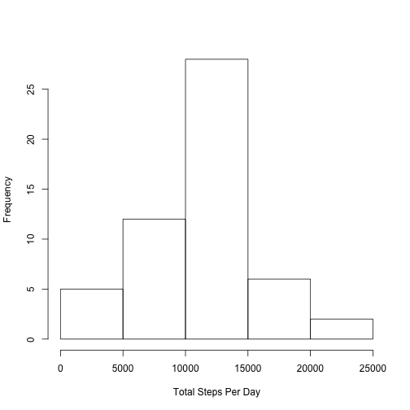
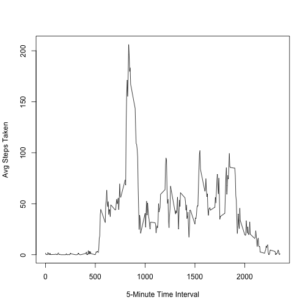
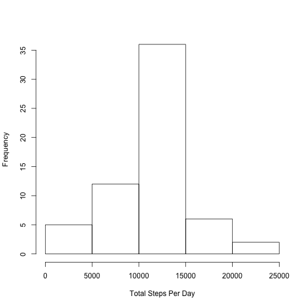

Reproducable Research Assignment 1

First, we download, read in, and clean up the data.


```r
## Download file
url<-"https://d396qusza40orc.cloudfront.net/repdata%2Fdata%2Factivity.zip"
dest<-"repdata_data_activity.zip"
download.file(url,destfile=dest,method="curl")
unzip("repdata_data_activity.zip")

## Read in file and clean up data
rawdata<-read.csv("activity.csv")
rawdata$date<-as.Date(rawdata$date,"%Y-%m-%d")
cleandata<-rawdata[complete.cases(rawdata),]
cleandata$date<-as.Date(cleandata$date,"%Y-%m-%d")
```

Steps Per Day


```r
## Calculate Steps Per Day
spd<-tapply(cleandata$steps,cleandata$date,sum,na.rm=TRUE)
hist(spd,xlab="Total Steps Per Day",main="")
```

 

Steps Per Day - Mean


```r
## Calculate Steps Per Day Mean
mean(spd,na.rm=TRUE)
```

```
## [1] 10766.19
```
Steps Per Day - Median


```r
## Calculate Steps Per Day Median
median(spd,na.rm=TRUE)
```

```
## [1] 10765
```

Average Number of Steps taken per time period


```r
## Calculate Average Steps Per Time Period.
astptp<-aggregate(cleandata$steps, by=list(cleandata$interval),FUN=mean)
colnames(astptp)<-c("interval","avgsteps")
plot(astptp,type="l",xlab="5-Minute Time Interval",ylab="Avg Steps Taken")
```

 

5-Minute Time Interval with the maximum number of steps is:


```r
## Show Time Interval with Max Avg Number of Steps
astptp[astptp$avgsteps==max(astptp$avgsteps),1]
```

```
## [1] 835
```

There was some NA (incomplete) data in the download which was cleaned to produce the results above. The number of rows with NA data are:


```r
## Calculate Average Steps Per Time Period.
nrow(rawdata)-nrow(cleandata)
```

```
## [1] 2304
```

To try and fill in the missing data with some sort of logical number, I chose to take the average number of steps over the data for that time interval and fill in the missing data to create a new dataset called FixedData.


```r
## Fill in missing data with mean of that 5-minute interval
missingdata<-rawdata[!complete.cases(rawdata),]
cleanmean<-function(x) mean(cleandata$steps[cleandata$interval==x])
for(i in 1:nrow(missingdata)){
     missingdata$steps[i]<-cleanmean(missingdata$interval[i])
}
fixeddata<-rbind(cleandata,missingdata)
```

Steps Per Day (fixed)


```r
## Calculate Average Steps Per Time Period with filled-in values
fspd<-tapply(fixeddata$steps,fixeddata$date,sum,na.rm=TRUE)
hist(fspd,xlab="Total Steps Per Day",main="")
```

 

Steps Per Day - Mean (fixed)


```r
## Calculate Steps Per Day Mean
mean(fspd,na.rm=TRUE)
```

```
## [1] 10766.19
```

Steps Per Day - Median (fixed)


```r
## Calculate Steps Per Day Median
median(fspd,na.rm=TRUE)
```

```
## [1] 10766.19
```

Weekend vs Weekday data


```r
## WE vs WD - add weekdaytype data to FixedData
fixeddata$weekdaytype<-"weekday"
fixeddata$weekdaytype[weekdays(fixeddata$date) %in% c("Saturday","Sunday")]<-"weekend"
#fixeddata$weekdaytype<-factor(fixeddata$weekdaytype)
#fixeddata$interval<-as.factor(fixeddata$interval)
wedata<-aggregate(fixeddata$steps,by=list(fixeddata$weekdaytype,fixeddata$interval),data=fixeddata,FUN=mean)
colnames(wedata) = c("weekdaytype","interval","avgsteps")

## Setup panel plot
library(lattice)
xyplot(wedata$avgsteps~wedata$interval|wedata$weekdaytype,data=wedata,type="l",groups=wedata$weekdaytype,layout=c(1,2),xlab="Time Interval",ylab="Avg Number of Steps")
```

 
